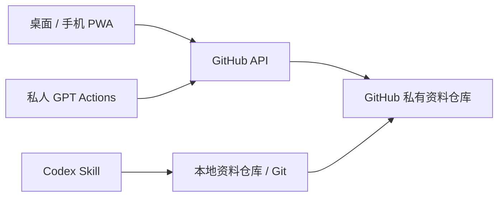

# 架构与实现边界

## 一份资料，三个入口

程序是 web/ 下的原生 JavaScript ES Modules 与 CSS。没有运行时后端、框架依赖或打包环节。页面不加载外部字体、统计脚本、图片服务；GitHub API 是唯一外部数据请求目的地。

IndexedDB 保存每个仓库/分支的本地正式文件、上次远端基线、提交号及本机活动记录；编辑草稿另存。GitHub PAT 按仓库保存在同一 IndexedDB 的独立 credentials 对象仓库中，与工作区、备份隔离；连接设置和凭据通过一次事务写入，应用启动时恢复到内存。数据库 v2 从 v1 升级时仅新增对象仓库，不重建资料。主动清除登录通过事务清空凭据区，并写入旧会话退役标记，防止残留 sessionStorage 令牌被重新迁移。切换本地空间不清除凭据，令牌自身有效性仍由 GitHub 控制。程序的应用缓存仅包含明确列出的静态资源，绝不缓存 GitHub 请求。

图片资料沿用 IndexedDB v2，不重建本地存储。工作区的文件映射以 Base64 保存图片字节、以字符串保存文字；GitHub 中图片为真实二进制。模块元数据持有附件引用和说明。编辑草稿的图片独立保存到 `draft:…:images` 记录，与草稿元数据同事务写入，避免每次输入文字都重写大图片。界面仅用本地 Blob URL 显示图片，卸载视图时撤销 URL；无需公开私有仓库或在图片地址中携带令牌。

## 同步

1. 固定远端分支 HEAD，读取该 commit 的 tree 与协议文件，避免读到多个版本拼成的快照。
2. 比较上次远端基线、本地文件、最新远端文件。
3. 不同主题自动合并。同一主题两端均修改则人工选择整份主题版本，可以先下载冲突副本。
4. 拉取把合并结果保存到本机，同时更新基线；保留本地尚未上传的差异。
5. 上传先完成上述拉取，将新图片以 Base64 创建 Git blob，再一次性创建包含全部差异的 tree 和 commit，最后以 `force:false` 更新分支。任何中间步骤失败都不会发布半份资料。
6. 并发写入使非快进更新失败，停止并保留本地修改，不进行盲目覆盖。

删除主题和另一端增加/修改其模块发生在同一冲突边界内；因此不会通过逐文件自动合并恢复一个被删除的主题。

PWA 不保存通用 Git 工作区，使用 GitHub Git Data API 的读取/提交实现产品中的「拉取 / 上传」。Codex 脚本使用本地 Git，双方使用同一文件协议。

## 首版范围

- 私人使用为主，支持多个获得权限的客户端写入同一资料仓库。
- 没有实时协同光标、组织权限、评论审批或自动后台同步。
- PWA 不推理，不调用模型，也不会自动读取聊天记录。
- AI 只有在相应 Skill / GPT 接入被启用，且用户要求沉淀时才读写。
- 支持模块图片附件（JPG/PNG/WebP），不支持视频、音频或通用二进制素材。图片选择后压缩，GIF 仅保留静态画面，HEIC 解码依赖浏览器，不保存压缩前原图。
- 最多 2000 个资料文件；文字单文件 300000 UTF-8 字节；每模块最多 10 张图片，单张最大 1.5 MiB、最长边 2560 像素，资料库图片总量最大 40 MiB。API 额度和分支保护仍由 GitHub 控制。
- 冲突采用主题级选择，未提供逐行可视合并。可下载双方文件后人工整理再导入。
- Markdown 显示支持标题、列表、引用、粗体、行内代码和代码块，以及当前模块图片的正文引用。图片只匹配 attachments 中的相对/仓库路径；不执行 HTML、不加载远程嵌入。编辑器保留正文光标位置，压缩完成后插入引用并同批保存图片草稿，实时预览复用本地 Blob URL。
- 浏览器存储不是永久备份；清除站点数据会移除未上传资料。上传到 GitHub或主动导出备份才有异地副本。
- 安装、离线模式与多窗口锁需要现代浏览器及 HTTPS / localhost；首次加载需联网。
- 更改域名或部署路径可能切换浏览器的存储环境。搬迁前先导出或同步，避免遗失本机草稿。

## 文件协议

以 [schema.md](../.agents/skills/game-idea-vault/references/schema.md) 为准。新增字段应保持其他客户端能够读取；破坏兼容性的变化必须提升版本并实现迁移，不能静默清空旧资料。

## 未执行的验证

遵照 AGENTS.md，本次未启动页面、自动化浏览器、单元测试、集成测试、lint、类型检查、编译检查或真实 GitHub/GPT 读写验证。图标与 OpenAPI 模板生成属于制作交付文件，不代表运行验证。发布工作流只托管静态目录，不会自动测试。
